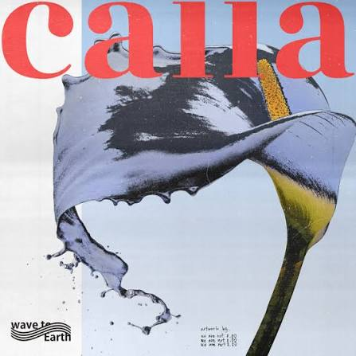

# my-personal-webpage
<!doctype html>
<html lang="en">
  <head>
    <meta charset="UTF-8" />
    <meta name="viewport" content="width=device-width, initial-scale=1.0" />
    <title>My Personal Webpage</title>

    
    

    <link rel="preconnect" href="https://fonts.googleapis.com" />
    <link rel="preconnect" href="https://fonts.googleapis.com" crossorigin />
    <link
      href="https://fonts.googleapis.com/css2?family=Baloo+2&display=swap"
      rel="stylesheet"
    />

    
  </head>

  <body>
    <!-- ==================== TOP NAVIGATION ==================== -->

    <nav class="top-nav" aria-label="Section navigation">
      <button type="button" class="nav-btn active" data-target="home">
        Home
      </button>

      <button type="button" class="nav-btn" data-target="part1">
        Student Info
      </button>

      <button type="button" class="nav-btn" data-target="part2">
        Favorite Songs
      </button>
    </nav>

    <!-- ==================== HOME ==================== -->

    

      

      <h1
        style="
          font-family: &quot;Baloo 2&quot;, cursive;
          font-size: 60px;
          margin-bottom: 10px;
        "
      >
        Sebastian Rove B. Medico
      </h1>

      
Welcome to my personal webpage

    

    <!-- ==================== ABOUT ME ==================== -->

    

      <h2>About Me</h2>

      

        I'm a college student who loves singing, gaming, and dancing whenever I
        get the chance. Right now I'm working toward becoming a Software
        Engineer or AI Engineer someday — and building this webpage is actually
        one of my first real steps into coding! it's been a fun challenge, and
        I'm excited to keep learning and improving my skills.
      

    

    <!-- ==================== PART 1 ==================== -->

    <h1
      id="part1-heading"
      class="section-toggle"
      onclick="toggleSection('part1')"
      aria-expanded="false"
    >
      Part 1: Student Information
    </h1>

    

      

        <h2>Student Info</h2>
        
Name: Sebastian Rove B. Medico

        
Student ID: 26-1-01620

        
Year & Section: 26-27 / UCOS 1-2

        
Age: 18

        
Gender: Male

      

      

        <h3>My Hobbies:</h3>

        <ul style="text-align: left">
          <li>Singing</li>
          <li>Playing Games</li>
          <li>Dancing</li>
        </ul>
      

      

        <h3>My Favorite Foods:</h3>

        <ul style="text-align: left">
          <li>Adobo</li>
          <li>Menudo</li>
          <li>Chicken</li>
          <li>Cake</li>
        </ul>
      

      

        <h3>My Ambition:</h3>
        
Be a Software Engineer or AI Engineer

      

      

        <h3>My Skills:</h3>

        <ul style="text-align: left">
          <li>HTML & CSS</li>
          <li>Java</li>
          <li>Canva</li>
        </ul>
      

      

        <h3>Fun Facts:</h3>

        <ul style="text-align: left">
          <li>Favorite Movie: Spider Man - Brand New Day</li>
          <li>Favorite Color: Black, White, Grey</li>

          <li>
            Favorite Quote: “Two things are infinite: the universe and human
            stupidity; and I'm not sure about the universe.”
          </li>
        </ul>
      

      

        <h3>My Achievements:</h3>

        <ul style="text-align: left">
          <li>Top 10 in Elementary</li>
          <li>Representative For Buwan ng Wika Singing Competition</li>
        </ul>
      

    

    <!-- ==================== PART 2 ==================== -->

    <h1
      id="part2-heading"
      class="section-toggle"
      onclick="toggleSection('part2')"
      aria-expanded="false"
    >
      Part 2: My Favorite Songs
    </h1>

    

      <!-- ERE -->

      

        

        <audio
          id="audio-ere"
          src="juan-karlos-ere-official-music-video_RY7Glno8.mp3"
        ></audio>

        <h3>Ere</h3>
        
by juan karlos

        <a
          href="https://open.spotify.com/track/0SuQMjb2TleiKg1ebQSDnX"
          style="color: #f31bc4"
          target="_blank"
        >
          Listen on Spotify
        </a>
      

      <!-- CALLA -->

      

        

        <audio id="audio-calla" src="calla_x1r0T9g5.mp3"></audio>

        <h3>Calla</h3>
        
by wave to earth

        <a
          href="https://open.spotify.com/track/0X9qVaLfmgFFaJaYv72V7A"
          style="color: #f31bc4"
          target="_blank"
        >
          Listen on Spotify
        </a>
      

      <!-- TOTOONG TAYO -->

      

        

        <audio id="audio-totoong-tayo" src="totoong-tayo_5wu6p3Fj.mp3"></audio>

        <h3>Totoong Tayo</h3>
        
by Jin DC

        <a
          href="https://open.spotify.com/track/3Fu4WzdH4SpUUPLroN4qyS"
          style="color: #f31bc4"
          target="_blank"
        >
          Listen on Spotify
        </a>
      

      <!-- PURE -->

      

        

        <audio
          id="audio-pure"
          src="sienna-spiro-pure-audio_ejHLmPcp.mp3"
        ></audio>

        <h3>Pure</h3>
        
by Sienna Spiro

        <a
          href="https://open.spotify.com/track/31IKMjvv6Oskp4hjGVeYsT"
          style="color: #f31bc4"
          target="_blank"
        >
          Listen on Spotify
        </a>
      

      <!-- PAST WON'T LEAVE MY BED -->

      

        

        <audio
          id="audio-past-wont-leave-my-bed"
          src="joji-past-won-t-leave-my-bed_yD6F0GsL.mp3"
        ></audio>

        <h3>Past Won't Leave My Bed</h3>
        
by Joji

        <a
          href="https://open.spotify.com/track/16Z0an8D4BJNm3VbWWpTnv"
          style="color: #f31bc4"
          target="_blank"
        >
          Listen on Spotify
        </a>
      

      <!-- ==================== SONG LYRICS ==================== -->

      

        <h1>Song Lyrics:</h1>

        

        <h2>Totoong Tayo</h2>
        <h3>by Jin DC</h3>

        <!-- VERSE 1 -->

        <h3>Verse 1:</h3>

        

          <b><i>Aking sinta</i></b
          > 

          <b>
            <i> Naalala mo paba ang dati nating pag-iibigan? </i> </b
          > 

          <b>
            <i> Sa gabing malalim </i> </b
          > 

          <b>
            <i> Mga usapang puro kulita't tawanan </i>
          </b>
        

        <!-- FIRST PRE-CHORUS -->

        <h3>Pre-Chorus:</h3>

        

          <b>
            <i> Ikaw at ako (ikaw at ako) </i> </b
          > 

          <b>
            <i> Ang magkasama sa mga alaala </i>
          </b>
        

        <!-- CHORUS -->

        <h3>Chorus:</h3>

        

          <b>
            <i> Puwede bang kalimutan muna natin ang mundo </i> </b
          > 

          <b>
            <i> At hawakan mo ang kamay ko? </i> </b
          > 

          <b>
            <i> Magmahalan na walang iniisip na kung ano </i> </b
          > 

          <u> Ipakita lang ang totoong tayo </u>
        

        <!-- VERSE 2 -->

        <h3>Verse 2:</h3>

        

          <b>
            <i> 'Di maiwasang ('di maiwasang) </i> </b
          > 

          <b>
            <i>
              Ipakita na wala tayong pakialam (sa buhay ng) sa buhay ng isa't
              isa
            </i> </b
          > 

          <b>
            <i> Huwag nang magpanggap pa (huwag nang magpanggap pa) </i> </b
          > 

          <b>
            <i> Kitang-kita na sa kilos mong kakaiba, ooh, ako pa ba? </i>
          </b>
        

        <!-- SECOND PRE-CHORUS -->

        <h3>Pre-Chorus:</h3>

        

          <b>
            <i> Ikaw at ako (ikaw at ako) </i> </b
          > 

          <b>
            <i> Ang magkasama sa mga alaala </i>
          </b>
        

        <!-- FINAL CHORUS -->

        <h3>Final Chorus:</h3>

        

          <b>
            <i> Puwede bang kalimutan muna natin ang mundo </i> </b
          > 

          <b>
            <i> At hawakan mo ang kamay ko? </i> </b
          > 

          <b>
            <i> Magmahalan na walang iniisip na kung ano </i> </b
          > 

          <b>
            <i> Ipakita lang ang totoong tayo </i>
          </b>
        

      

    

    <!-- ==================== FOOTER ==================== -->

    <footer
      style="
        text-align: center;
        color: rgba(255, 255, 255, 0.6);
        padding: 40px 20px 60px;
        margin-top: 20px;
        border-top: 1px solid rgba(255, 255, 255, 0.15);
        font-size: 14px;
      "
    >
      
Thanks for visiting my personal webpage!

      
— Sebastian Rove B. Medico

    </footer>

    <!-- ==================== JAVASCRIPT ==================== -->

    
  </body>
</html>
